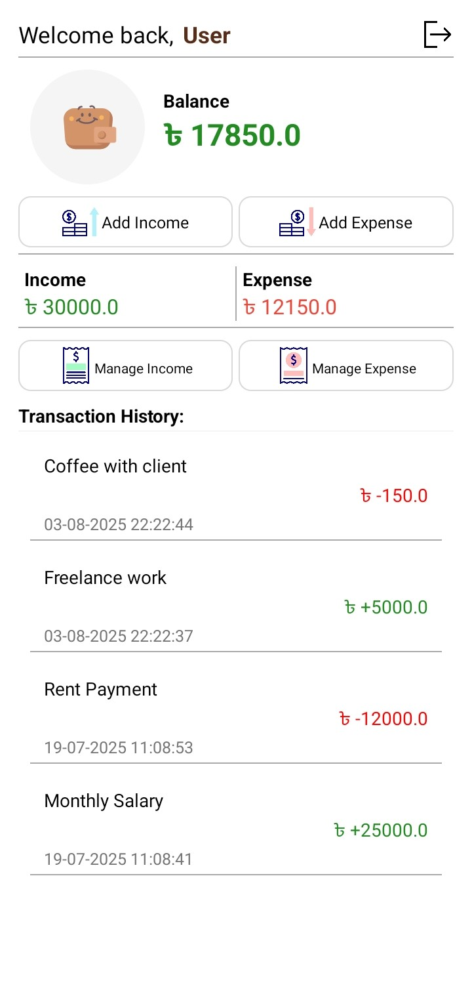
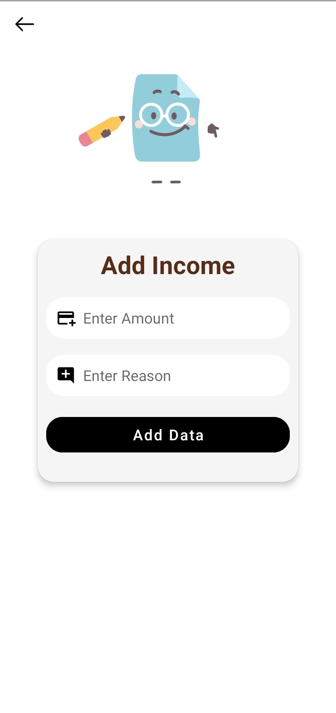
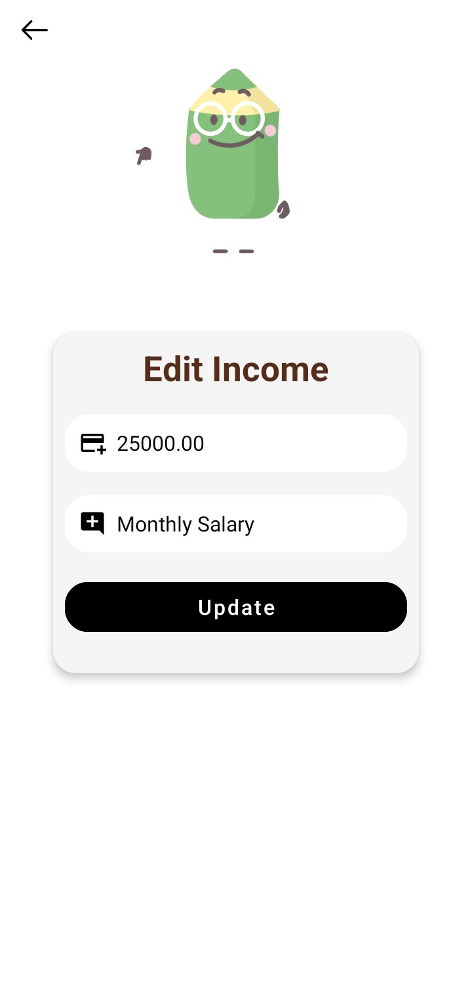
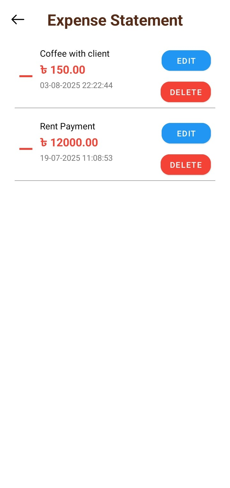

  

<h1 align="center">AyBay Lite</h1>

<i>
A powerful and lightweight Android application for tracking income, expenses, budgets, savings, loans, and more.
</i>

---

## ✨ Features

- 📊 Track income and expenses (Lite Version)
- 🏦 Manage loans and debts (owe tracking)
- 💰 Monitor savings and budgets
- 🔍 Search and filter transactions by date or type
- 🧠 Built-in AI chatbot for financial suggestions (Premium only)
- ☁️ Backup and restore data from Google Drive or local storage
- 📅 View daily, monthly, and yearly statistics
- 🔒 Secure and offline-first with local SQLite storage
- ⚙️ Simple, clean, and fast UI with dark/light mode

---

## 📥 Installation

You can install AyBay Lite from:

---

## 🧪 Architecture & Testing

- Follows an MVC-ish layered architecture
- Controller classes handle logic (e.g., `AddExpenseHelper`, `DashboardManager`)
- Data is stored locally using SQLite (`DatabaseHelper`)
- Unit tests written using **JUnit 5** and **Mockito**
- Proper assertions (`assertEquals`, `assertThrows`, `verify`, etc.)
- Sample test: Ensure invalid inputs throw `IllegalArgumentException`

---

## 💻 Built With

- Java (Android SDK)
- XML for UI layouts
- SQLite (via `DatabaseHelper`)
- JUnit 5 + Mockito for testing

---

## 📸 Screenshots

   &nbsp;
   &nbsp;
  

   &nbsp;
   &nbsp;
  

---

## ⚠️ Disclaimer

This app is for educational and personal finance management purposes only.  
It is not associated with any banking or financial institution.
